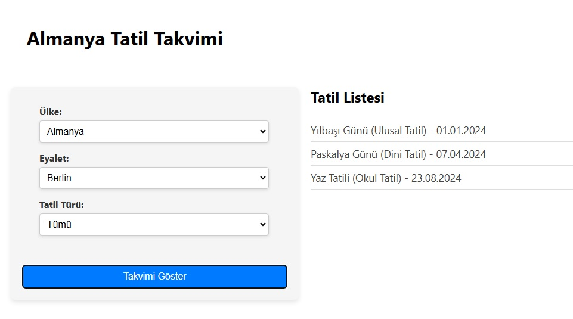

# Almanya Tatil Takvimi

<div align="center">
  <h3 align="center">Almanya Tatil Takvimi</h3>
  <p align="center">
    <b>Frontend :</b> Kullanıcıların tatilleri ülke ve bölge bazında görüntüleyebileceği bir arayüz sunar.  <br />
    Seçili ülke, eyalet ve tatil türüne göre tatilleri filtreler ve takvim üzerinde gösterir.<br />
  </p>
   <p align="center">
     <b>Backend :</b>Tatil verilerini sunmak için bir API sağlar.  <br /> Kullanıcıların ülke, bölge ve tatil türüne göre filtreleme yapmasına izin verir <br />
  </p>
</div>

## Kullanılan Teknolojiler

-	React.js: Kullanıcı arayüzünü oluşturmak için.
-	React Calendar: Takvim bileşenini göstermek için.
-	CSS: Arayüz tasarımı ve stillendirme için
-	Node.js: Sunucu tarafında çalışır.
- Express.js: API oluşturmak için.
- CORS: Frontend ve backend arasında veri aktarımı için.


## Proje Ekran Görüntüleri



## Kurulum Talimatı

Proje dosyalarını bilgisayarınıza kopyaladıktan sonra aşağıdaki adımları izleyin:

### Gereksinimler

- Node.js (v14 veya üstü)
- npm veya yarn paket yöneticisi

### Adımlar

1. Proje dosyalarını indirin veya klonlayın:
   ```bash
   git clone https://github.com/kubalgul/holiday-calendar-frontend.git
   cd holiday-calendar-frontend

   
2. Bağımlılıkları Yükleyin:
   ```bash
   npm install
   
3. Çalıştırın:
   ```bash
   npm start

4. Uygulamaya yerel sunucunuz üzerinden erişebilirsiniz:
   ```bash
   http://localhost:3000


### Kullanım

Uygulama açıldığında, Almanya ve eyaletlerindeki tatilleri görüntüleyebilirsiniz.
Menüdeki filtreleri kullanarak tatilleri türlerine göre filtreleyebilirsiniz.


   
